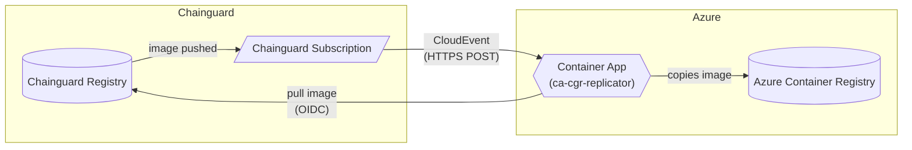

# image-copy-acr

Terraform module that deploys the `image-copy-acr` service to Azure Container Apps. The service subscribes to Chainguard registry push events and automatically copies new images into an Azure Container Registry (ACR).

> This is an image mirroring service, not a pull-through caching service.
> This service will mirror all images in your Chainguard registry to your Azure Container Registry; it is not currently configured for targeted image replication.

If you supply `existing_acr_name` (and `existing_acr_resource_group`), Terraform will reuse that registry instead of creating a new ACR instance. If you want to create a new ACR instance, leave both variables unset and Terraform creates a fresh Basic-tier ACR in the generated resource group. The rest of the deployment (Container App, managed identity, Chainguard identity and subscription) is identical.

## How it works



1. Chainguard sends a CloudEvent (HTTPS POST) to the Container App's public HTTPS endpoint whenever an image is pushed to any repository in your group.
2. The app requests a managed identity token scoped to a dedicated Azure AD application.
3. The app copies the image to the target ACR using its managed identity for authentication.

---

## Resources created

### Azure

| Resource | Name | Notes |
|---|---|---|
| Resource Group | `rg-cgr-imagereplication-<random>` | All resources below are placed here unless noted |
| Container Registry | `acrcgr<random>` | Created only when no existing ACR is supplied |
| User-Assigned Managed Identity | `mi-cgr-acr-pushpull` | Used by the Container App to pull/push ACR images |
| Role Assignment | `AcrPull` | Scoped to the resource group that contains the ACR |
| Role Assignment | `AcrPush` | Scoped to the resource group that contains the ACR |
| Container App Environment | `ace-cgr-replicator` | Consumption (serverless) plan |
| Container App | `ca-cgr-replicator` | Runs the ko-built replicator image |
| Azure AD Application | `cgr-image-copier-chainguard-audience` | Permission-free app used as the token audience for Chainguard STS exchange |
| Azure AD Service Principal | `cgr-image-copier-chainguard-audience` | Required for Azure AD to recognise the app as a valid token resource |

### Chainguard

| Resource | Description |
|---|---|
| `chainguard_identity` | Workload identity bound to the managed identity via Azure AD claim matching |
| `chainguard_rolebinding` | Grants the identity `registry.pull` on the target group |
| `chainguard_rolebinding` | Grants the identity `viewer` on the target group (needed for signature verification) |
| `chainguard_subscription` | Sends push events to the Container App's public URL |

---

## Prerequisites

### Tools

- [Terraform](https://developer.hashicorp.com/terraform/install) >= 1.3
- [Azure CLI](https://learn.microsoft.com/en-us/cli/azure/install-azure-cli) — authenticated with `az login`
- [Chainguard CLI (`chainctl`)](https://edu.chainguard.dev/chainguard/chainguard-enforce/how-to-install-chainctl/) — authenticated with `chainctl auth login`

### Azure permissions

The identity running Terraform needs:

- **Contributor** (or equivalent) on the subscription or resource group to create resources
- **User Access Administrator** on the ACR's resource group to assign AcrPull/AcrPush roles
- **Permission to register Azure AD applications** — required when `create_application = true` (the default). Enabled for all users in most tenants. If app registration is disabled in your tenant, have an admin create the app, set `create_application = false` and supply `token_scope` and `claim_match_audience` (see security note in the Variables section).

### Chainguard permissions

The identity running Terraform needs **Owner** or **Editor** on the target Chainguard group to create identities, role bindings, and subscriptions.

---

## Deployment steps

### 1. Authenticate

```sh
az login
chainctl auth login
```

### 2. Copy and edit tfvars

```sh
cp iac/terraform.tfvars.example iac/terraform.tfvars
```

Edit `iac/terraform.tfvars`. See the [Variables](#variables) section below for the full list of available variables.

### 3. Authenticate to the ACR

Terraform builds and pushes the container image using `ko` during `tf apply`. The Azure CLI must be authenticated to the ACR before running `tf apply` so that ko can push the image.

**New ACR (Terraform will create it):** Targeted apply that will create the ACR registry which you will then log into using the `az acr login` command:

```sh
cd iac
tf init
tf apply -target=azurerm_container_registry.new
az acr login --name $(tf output -raw new_acr_name)
```

**Existing ACR:**

```sh
az acr login --name <existing_acr_name>
```

### 4. Initialize and apply

```sh
cd iac #If not already there from previous step
tf init
tf apply
```

Review the plan and confirm. On the first run this takes a few minutes — ko builds and pushes the image before the Container App is created.

### 5. Verify

```sh
tf output webhook_url   # Chainguard subscription sink
tf output dst_repo      # Where images are copied to
```

You can also check the Container App logs in the Azure Portal or via:

```sh
az containerapp logs show \
  --name ca-cgr-replicator \
  --resource-group $(terraform output -raw resource_group) \
  --follow
```

---

## Variables

| Variable | Required | Default | Description |
|---|---|---|---|
| `chainguard_org` | yes | — | Chainguard organization name (e.g. `your.org.com`) |
| `location` | no | `eastus` | Azure region |
| `dst_repo_prefix` | no | `chainguard` | Path prefix in the ACR for copied images |
| `ignore_referrers` | no | `false` | Skip copying signature/attestation tags |
| `verify_signatures` | no | `false` | Verify Chainguard signatures before copying |
| `existing_acr_name` | no | `""` | Name of an existing ACR to use; leave blank to create one |
| `existing_acr_resource_group` | no | `""` | Resource group of the existing ACR; required when `existing_acr_name` is set |
| `create_application` | no | `true` | Create a dedicated Azure AD app to scope Chainguard tokens |
| `token_scope` | no | `""` | OAuth2 scope passed to GetToken (e.g. `api://<client-id>`); required when `create_application = false` |
| `claim_match_audience` | no | `""` | Expected `aud` claim in the issued token; required when `create_application = false` |
| `claim_match_issuer` | no | `""` | Expected `iss` claim; defaults to the v2 tenant-specific Azure AD issuer |

### Token audience security note

When `create_application = true` (the default), Terraform creates a dedicated, permission-free Entra ID application and automatically derives `token_scope` and `claim_match_audience` from it. Because the app has no permissions and its client ID is unique to this deployment, the token cannot be used to access any Azure resource or accepted by any other federated identity service.

If you don't have permissions to create an application, ask your administrator
to create one for you and provide the client ID with the `token_scope` and
`claim_match_audience` variables directly.

```hcl
create_application   = false
token_scope          = "api://<client-id>"
claim_match_audience = "<client-id>"
```

If you can't create an application, you may consider using the `api://AzureADTokenExchange` scope. However, be aware that `api://AzureADTokenExchange` is intended for inbound and cross-tenant workload identity federation. Tokens issued for it may be usable across other tenants or for applications that allow federation from other clouds — it is not scoped exclusively to Chainguard.

```hcl
create_application   = false
token_scope          = "api://AzureADTokenExchange"
claim_match_audience = "fb60f99c-7a34-4190-8149-302f77469936"
```

## Outputs

| Output | Description |
|---|---|
| `resource_group` | Name of the generated resource group |
| `new_acr_name` | Name of the newly created ACR; null when reusing an existing one |
| `acr_login_server` | ACR hostname (e.g. `myregistry.azurecr.io`) |
| `acr_id` | Full Azure resource ID of the ACR |
| `dst_repo` | Full destination repo prefix for copied images |
| `webhook_url` | Public URL of the Container App / Chainguard subscription sink |
| `managed_identity_id` | Resource ID of `mi-cgr-acr-pushpull` |
| `chainguard_identity_id` | Chainguard identity ID used by the Container App |

---

## Teardown

```sh
cd iac
tf destroy
```

This removes all resources created by this module, including the Chainguard subscription, identity, and role binding.
